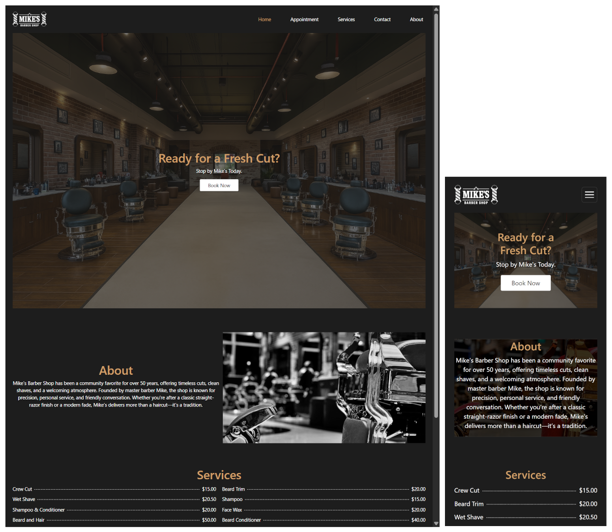
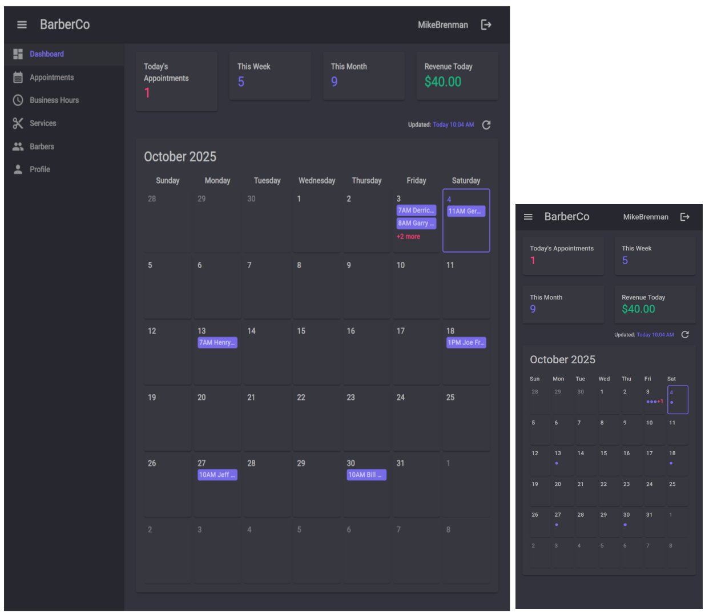
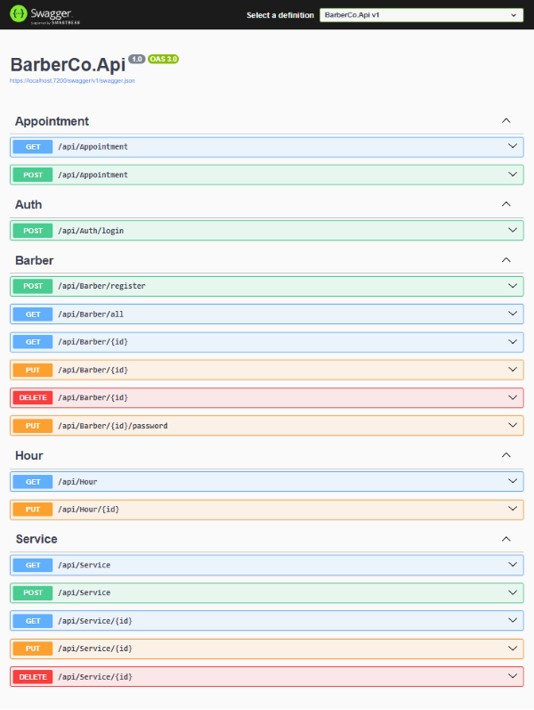

# BarberCo

A full-stack proof of concept application demonstrating modern web development with .NET, Blazor, and Azure cloud services.

## Overview

BarberCo is a complete barber shop management system consisting of three main components:
- **BarberCo.Web** - Customer-facing website for the fictitious "Mike's Barber Shop"
- **BarberCo.Management** - Administrative portal for barbers to manage appointments
- **BarberCo.Api** - RESTful API providing data for both frontend applications

## Live Demo

- 🌐 **Customer Website**: [https://barberco-web.salmonsmoke-ad46fcca.eastus.azurecontainerapps.io/](https://barberco-web.salmonsmoke-ad46fcca.eastus.azurecontainerapps.io/)
- 👨‍💼 **Management Portal**: [https://barberco-management.salmonsmoke-ad46fcca.eastus.azurecontainerapps.io/](https://barberco-management.salmonsmoke-ad46fcca.eastus.azurecontainerapps.io/)

### Test Credentials for Management Portal

| Username | Password | Role |
|----------|----------|------|
| JoeLouden | oak-water-cougarD4 | barber |
| MikeBrenman | slowly-wood-chocolateW9 | admin |

## Project Components

### BarberCo.Web
Customer-facing website where customers can:
- Book appointments
- View business hours
- Access contact information

**Tech Stack:**
- Blazor Server
- Pure HTML/CSS (no UI libraries)
- ApiKey Authentication with BarberCo.Api
- Hosted on Azure Container Apps

### BarberCo.Management
Administrative portal for barbers featuring:
- Appointment management dashboard
- Offline access capabilities
- Role-based access (admin/barber)

**Tech Stack:**
- Blazor WebAssembly (WASM)
- MudBlazor UI component library
- JWT Authentication with BarberCo.Api
- Hosted on Azure Container Apps

### BarberCo.Api
RESTful API serving both frontend applications

**Tech Stack:**
- .NET Core Web API
- Entity Framework Core (ORM)
- Entity Framework Core Identity for Authentication
- Azure SQL Database
- Dual authentication schemes (JWT & ApiKey)
- Hosted on Azure Container Apps

## Technologies Used

- **Backend**: .NET Core, Entity Framework Core
- **Frontend**: Blazor (Server & WebAssembly)
- **Database**: Azure SQL
- **Cloud**: Azure Container Apps
- **Authentication**: JWT & ApiKey
- **UI Library**: MudBlazor (Management Portal)

## Author

**Weston Burkholder**
- GitHub: [@westonburk](https://github.com/westonburk)
- Website: [westonburkholder.com](https://westonburkholder.com)

## License

This project is available for viewing and educational purposes. Please contact me for any other use.